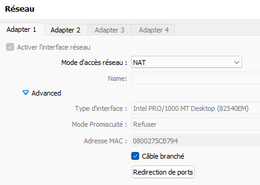
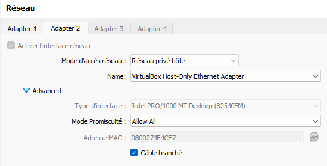

# network-anomaly-detection-system

Ce projet met en œuvre une infrastructure de sécurité et de surveillance de réseau conteneurisée avec **Docker Compose**. Elle combine un moteur de détection d'intrusions (**Suricata**), un collecteur et centralisateur de logs (**syslog-ng**) et une pile d'analyse et de visualisation (**Elasticsearch & Kibana**), afin de surveiller et protéger un serveur web applicatif.

---

## 1. Architecture Générale

Le réseau s'appuie sur une interface **Host-Only** (`192.168.56.0/24`) isolée pour simuler un environnement de production.

**Schéma d'architecture à integrer**

### Flux de données et corrélation :

- Suricata (IDS) : Inspecte le trafic réseau à destination du conteneur web et génère des alertes JSON structurées dans `./logs/suricata/eve.json`.
- Serveur Web Apache : Enregistre chaque requête reçue et le code de réponse HTTP dans `./logs/apache/access.log`.
- Syslog-ng : Collecte, extrait et transmet de manière unifiée les flux de logs vers Elasticsearch.
- Elasticsearch & Kibana : Indexe les événements et fournit un tableau de bord SOC en temps réel pour l'analyse des menaces.

## 2. Structure du dépôt

```text
.
├── README.md                   # Guide d'accueil et déploiement rapide
├── docker-compose.yml          # Orchestration unifiée des conteneurs
├── configs/                    # Fichiers de configuration des services
│   ├── suricata/               # Configuration et règles IDS local.rules
│   ├── syslog-ng/              # Fichiers de pipelines de collecte
├── html/                       # Code applicatif cible (index.php)
├── scenarios/                  # Scripts d'automatisation des attaques
│   └── run_all_attacks.sh      # Script d'exécution des 5 scénarios
├── docs/                       # Documentation détaillée du projet
│   ├── scenarios.md            # Fiches techniques des 5 attaques et règles IDS
│   └── visualisations.md       # Spécifications du Dashboard Kibana
└── .gitignore                  # Exclusion des logs et données de stockage
```

## 3. Guide de déploiement rapide

### Pré-requis
- Docker et Docker Compose installés sur l'hôte.
- Accès à Internet pour télécharger les images officielles.
- Interface réseau Host-Only configurée (192.168.56.0/24).

### Configurer une VM Linux :

1. Ouvrir Oracl VirtualBox et créer une nouvelle machine virtuelle.
2. Importer l'image Ubuntu Server 26.04.1 (64 bits) et allouer au moins 4 à 8 Go de RAM.
3. Configurer une première interface réseau en mode "NAT" pour l'accès à Internet et une seconde interface en mode "Host-Only" pour la communication avec les conteneurs Docker.


4. Installer Docker et Docker Compose sur la VM Ubuntu.
```bash
sudo apt update
sudo apt install docker.io docker-compose -y
sudo systemctl enable docker
sudo systemctl start docker
```
5. Augmenter la mémore virtuelle maximale pour ElastiSearch
```bash
sudo sysctl -w vm.max_map_count=262144
echo "vm.max_map_count=262144" | sudo tee -a /etc/sysctl.conf
```

### Lancement de l'infrastructure
<i>Tous les outils sont packagés dans des conteneurs Docker pour simplifier le déploiement et l'isolation. Il n'est donc pas nécessaire d'installer manuellement chaque composant sur l'hôte.</i>

1. Cloner le dépôt et lancer les conteneurs :

```bash
git clone https://github.com/GSavatte/network-anomaly-detection-system.git
cd network-anomaly-detection-system
docker-compose up -d
```

2. Vérifier que tous les conteneurs sont opérationnels :

```bash
docker-compose ps
```

3. Exécuter les scénarios d'attaques automatisés :

Récupérer le script `run_all_attacks.sh` dans le répertoire `scenarios/` et l'exécuter pour simuler les 5 scénarios d'attaques documentés.

```bash
bash scenarios/run_all_attacks.sh
```

## 4. Scénarios d'Attaques & Détections IDS

5 scénarios d'attaque distincts ont été implémentés et validés avec des niveaux de sévérité gradués :

| SID | Nom du scénario | Vecteur / Méthode | Sévérité |
| :--- | :--- | :--- | :--- |
| **1000001** | Test PHP Exploit | `GET /index.php?exploit=1` | 3 (Basse) |
| **1000002** | Path Traversal | `GET /index.php?file=../../../../etc/passwd` | 2 (Moyenne) |
| **1000003** | Remote Command Execution | `GET /index.php?cmd=whoami` | 1 (Haute) |
| **1000004** | High Rate Requests | Rafale de 50 requêtes HTTP consécutives | 1 (Haute) |
| **1000005** | HTTP Password Brute Force | `POST /login.php` avec plusieurs tentatives | 2 (Moyenne) |

👉 **[Consulter la documentation détaillée des scénarios (docs/scenarios.md)](docs/scenarios.md)** pour retrouver les justifications techniques, le code complet des règles Suricata, les extraits de logs et les recommandations de remédiation pour l'administrateur.

---

## 5. Visualisation Kibana & Tableau de Bord

Le tableau de bord Kibana `SIEM_Security_Overview` offre une vue globale sur les menaces :
* **Nombres clés :** Volume total des alertes et comptage des attaques critiques (Sévérité 1).
* **Répartition des priorités :** Graphique Donut catégorisant les alertes Snort/Suricata.
* **Évolution temporelle :** Suivi dynamique des pics d'attaques (détection visuelle des DoS).
* **Registre d'audit SOC :** Table détaillée croisant timestamps, IPs sources, signatures et URIs.

👉 **[Consulter les spécifications et la procédure d'importation du Dashboard (docs/visualisations.md)](docs/visualisations.md)**.

---

## 6. Membres du Projet & Répartition des Rôles

* **Gabriel Savatte :** Déploiement de l'infrastructure web/IDS, écriture des règles Suricata, création des scripts d'attaques et rédaction de la documentation projet.
* **Natan Marchais :** Configuration du centralisateur de logs (`syslog-ng`), intégration et déploiement de la stack ELK (`Elasticsearch` / `Kibana`) et assemblage du dashboard.